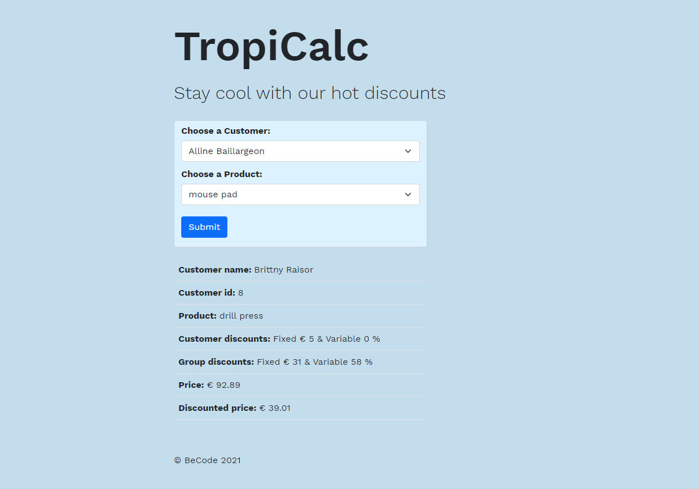

# Title: PHP Price Calculator challenge

- Repository: `php-pricecalculator-challenge`
- Type of Challenge: `Learning challenge`
- Duration: `4 days`
- Deployment strategy : `NA`
- Team challenge : `pairs`

## Project contributors:
- Elisabeta Ghidiu
- Mick Dellaert

## What did we learn?
- Structuring a project
- Importing data from database
- Apply basic OOP principles
- Learning how to use an MVC model in a project 
- Working in a small team
- Dividing tasks
- Communicating about tasks and approach

## Struggles?
- How to access methods of classes located in different files
- Sometimes OOP worked more against structuring than in favor of it
- Understanding how a controller works in MVC and how it communicates with the model and the view

## The takeaway
- Thinking more ahead about the structure instead of making the structure up as we go along
- Make OOP work in favor of the project

# TO DO:
## Preparation: 14/06 - morning
- [x] Read up on MVC project structure
- [x] Clone MVC boilerplate
- [x] Connect to local server  
- [x] Make GitHub repo

## Project steps 1: timing 14/06 - afternoon
- [x] Make database
- [x] Import data
- [x] Make the different classes

## Project steps 2 - planning 15/06
- [x] Make class for productloader
- [x] Make class for customerloader
- [x] Create dropdown list
- [x] Display information in the view

## Project steps 3 - planning 16/06
- [x] Get selected values from dropdown
- [x] Get groups and discounts from user
- [x] Make Customer group class

## Project steps 4 - planning 17/06
- [x] Make Customer group loader class
- [x] Make Calculator class
- [x] Calculate the price

## Project steps 4 - planning 18/06 
- [x] Calculate the price continued
- [x] Allround fixes
- [x] Added basic styling
- [x] Added comments in code

